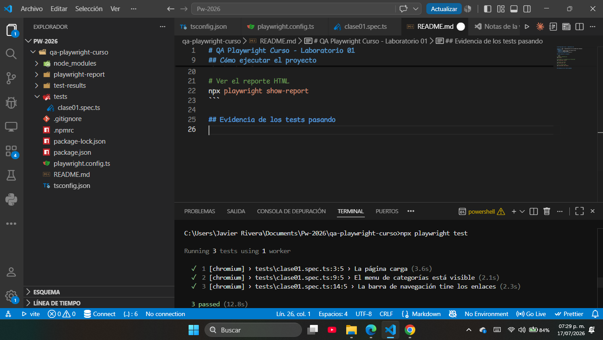
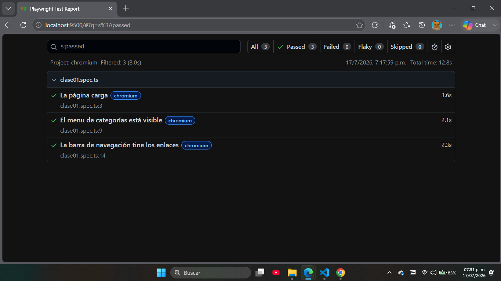

# QA Playwright Curso - Laboratorio 01

**Curso:** 048 - Aseguramiento de la Calidad del Software
**Módulo:** I
- **Nombre:** Javier José Luis Rivera Pérez
- **Carné:** 1790-22-10552
- **Versión de Node.js:** v22.17.1

## Cómo ejecutar el proyecto

```bash
# Instalar dependencias
npm install

# Descargar los navegadores de Playwright
npx playwright install

# Ejecutar los tests
npx playwright test

# Ver el reporte HTML
npx playwright show-report
```

## Evidencia de los tests pasando
Ejecución en terminal con los 3 tests en verde (passed):



Reporte HTML de Playwright:




